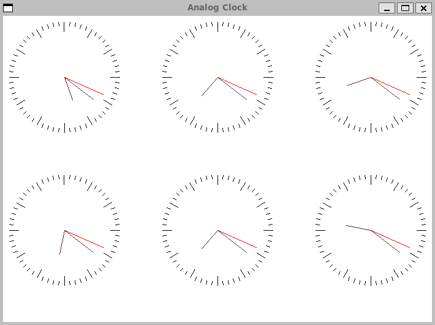

# Тестовое задание
## Отображения аналоговых часов
Часы отображают время относительно локальному:

-2 часа⠀⠀⠀⠀⠀0 локальное время⠀⠀⠀⠀⠀+1 час

-1 час⠀⠀⠀⠀⠀⠀0 локальное время⠀⠀⠀⠀⠀+2 часа

## Сборка
Для сборки приложения нужно склонировать [репозиторий](https://github.com/tokimiki4ika/Analog-Clock.git)

Затем зайти в репозиторий в директорию src и ввести `make` в терминал.

Приложение будет находится по пути **src/AnalogClock**.

Зависимости системы:
- make
- cmake
- SDL2
- g++
- doxygen(для dvi)

Для сборки документации нужно в репозитории в директорию src и ввести `make dvi` в терминал.

Документация будет находится по **пути documentation/html**.